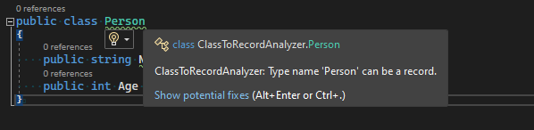
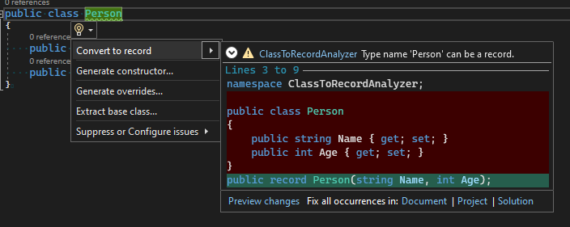

# Class➡️Record Analyzer
Simple analyzer that helps to convert a simple class to a record, when you use Visual Studio`s feature to "Paste special as JSON" to create the class from the JSON in your clipboard it creates a class, when that analyzer will help to convert this class to a record.

An class must meet following requirements to trigger analyzer:
- Have only public properties

# Showcase

## Diagnostic reported

## Code Fix

# Resources

- https://roslynquoter.azurewebsites.net/
- https://sharplab.io/